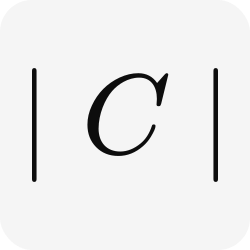
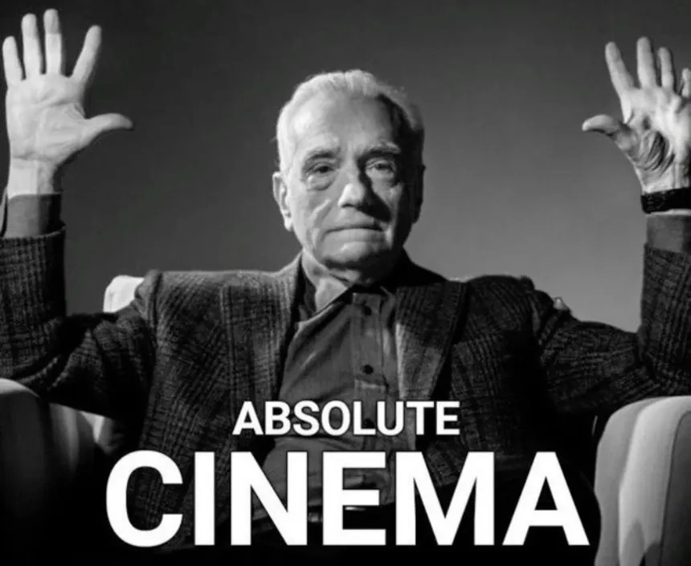

<!-- Logo -->

    <picture>
        <source media="(prefers-color-scheme: dark)" srcset="./.github/assets/light-icon.svg"/>
        <source media="(prefers-color-scheme: light)" srcset="./.github/assets/dark-icon.svg"/>
        
    </picture>

<!-- Project Name -->
<h1 align="center">Asolute Cinema</h1>

<!-- Tech tools -->

    
    
    
    
    

<!-- Description -->

`Absolute Cinema` es un **sistema de administración de cine**, enfocado
a un cine ficticio. Contiene las características básicas para el
funcionamiento de un cinema.

> [!IMPORTANT]
> 🚧 El proyecto está en desarrollo, pasará por las etápas básicas del desarrollo de software: investigación, definición de requerimientos, modelo de datos, arquitectura, infraestructura e implementación.

## 🎲 Brand

La idea del nombre del cine viene por el meme "absolute cinema", este
es utilizado para comentar positivamente acerca de un evento dramático.

> [!NOTE]
> El logo tiene el mismo sentido, es un valor absoluto del cinema
> ($\mid C \mid$), esto porque tenía lógica y lo matemático
> llega a ser formal y elegante.

 
