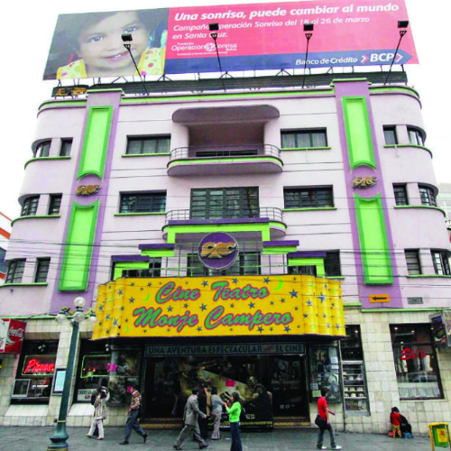
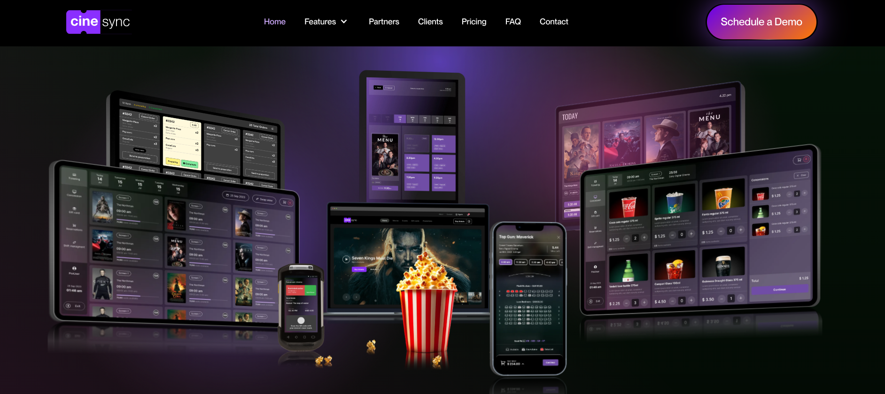

<h1 align="center">🤯 Problemática</h1>

A grandes rasgos, un _cinema_ es un negocio, pequeño o grande, que
se encarga de:

- La exhibición de películas 🎥
- La venta de boletos 🎫
- La venta de alimentos y bebidas 🍿🥤

La gestión de un cine es una tarea compleja que requiere de
herramientas adecuadas para facilitar el proceso, mejorar la eficiencia
e integrar la experiencia del cliente mediante elementos digitales
como páginas web, aplicaciones móviles, etc.

## Caso de estudio ☝️🤓

El "[_Cine Monje Campero_](https://www.monjecampero.com.bo/)" es uno de
los cines más memorables de la ciudad de La Paz, Bolivia. Está
ubicado en el centro de la ciudad, en la Av. 16 de Julio.

<table>
	<tr>
		<td align="center" width="50%">
			
			 
			<em>Ubicación del Cine Monje Campero</em>
		</td>
		<td align="center" width="50%">
			
			 
			<em>Fachada del Cine Monje Campero</em>
		</td>
	</tr>
</table>

Un cine pequeño de una sola sucursal con dos salas de exhibición,
una sola taquilla para la venta de boletos y un pequeño local de
venta de alimentos.

> [!IMPORTANT]
> El cine solo literalmente solo tiene una sucursal, es
> un cine local pequeño, un caso de estudio ideal para
> analizar la transición de un cine tradicional a un cine moderno.

El problema radica en que el "_Cine Monje Campero_" no cuenta con
un sistema de información que integre la **parte administrativa**
y la **experiencia del cliente**, lo que limita su capacidad de crecimiento
y competitividad en el mercado.

Aunque no tengamos acceso a la información interna del cine, o los
métodos que utilizan para gestionar su información, es posible inferir
que no cuentan con herramientas complejas por la falta de presencia
digital.

> [!NOTE]
> Aunque suponemos que el cine es deficiente en su manejo tecnológico,
> no se puede negar el hecho de que es una alternativa simple y
> accesible para muchas personas, desde estudiantes hasta
> adultos mayores.

## Estado actual del cine

Es inevitable no comparar el "_Cine Monje Campero_" con otros cines
de la ciudad, como el "_Multicine_", en diferentes aspectos que
suponen problemas para el primero, como:

- [ ] Plataforma web dinámica que centralice cartelera, horarios, precios y noticias
- [ ] Cartelera actualizada en tiempo real con filtros por género, formato y sala
- [ ] Programación de funciones y disponibilidad de asientos visible para clientes
- [ ] Venta de boletos en línea con selección de asientos y confirmación digital
- [ ] Canal de comunicación con clientes (email, SMS o notificaciones)

<table>
	<tr>
		<td align="center" width="50%">
			
			 
			<em>Un sitio web estático que depende de las publicaciones.</em>
		</td>
		<td align="center" width="50%">
			
			 
			<em>Un sitio web dinámico conectado a un DBS.</em>
		</td>
	</tr>
</table>

Además de esto, debemos incluir aspectos relacionados con la
administración del cine, como:

- [ ] Gestión centralizada de películas, horarios y salas desde un panel administrativo
- [ ] Control de taquilla y POS para ventas en ventanilla y conciliación diaria
- [ ] Gestión de ventas, caja y reportes financieros operativos
- [ ] Gestión de promociones, cupones y reglas de descuento
- [ ] Gestión de inventario de alimentos y bebidas con control de stock
- [ ] Gestión de clientes y empleados con roles y permisos
- [ ] Integración con pasarelas de pago y servicios externos clave

> [!TIP]
> El _Multicine_ hace uso de un servicio de terceros
> llamado [cinesync](https://www.cinesync.io/)
> para gestionar todo, literalmente es un
> Cinema as a Service (CaaS) que se encarga de
> toda la parte administrativa y de experiencia
> del cliente.
>
> 

Todo estos TODOs representan problemas que el "_Cine Monje Campero_"
enfrenta actualmente y que pueden ser resueltos mediante la implementación
de un sistema de información.
